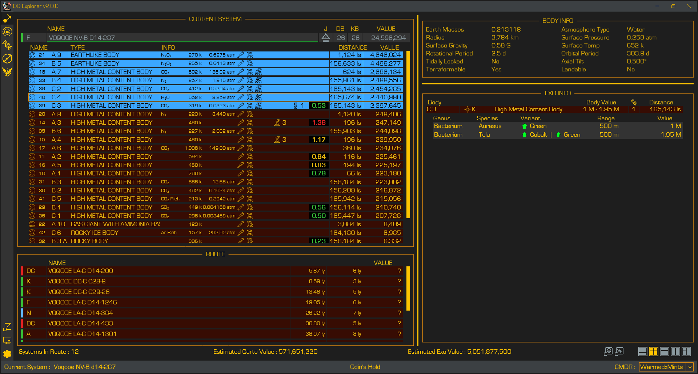
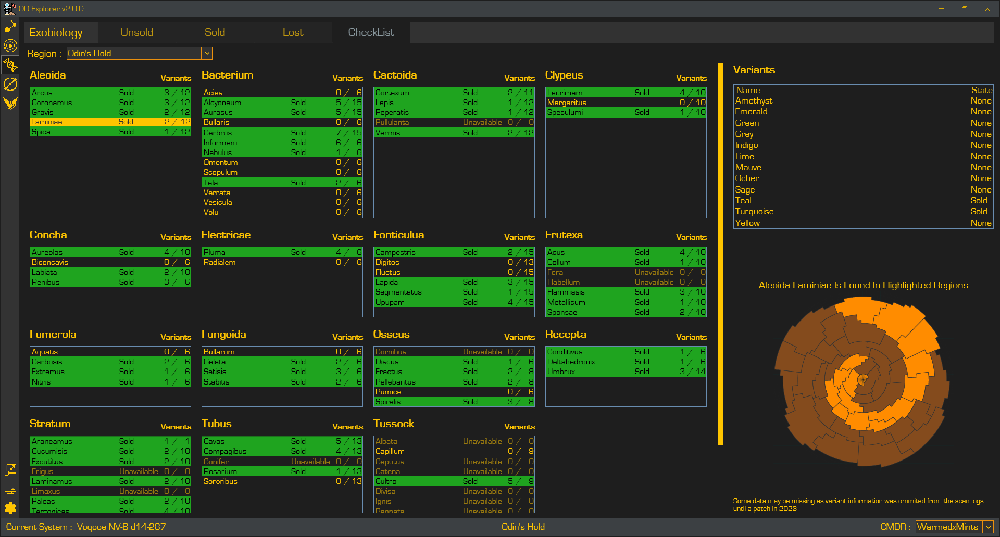

# OD-Explorer

OD Explorer is a companion app for Elite Dangerous which aids Commaders in exploration and exobiology research.

[Click here for the latest release](https://github.com/WarmedxMints/OD-Explorer/releases)

OD Explorer is not affiliated with [Frontier Developments](https://www.frontier.co.uk/), the developers of [Elite Dangerous](https://www.elitedangerous.com/).

OD Explorer requires .NET 8 x64 destop runtime which can be obtained [here](https://download.visualstudio.microsoft.com/download/pr/53e9e41c-b362-4598-9985-45f989518016/53c5e1919ba2fe23273f2abaff65595b/dotnet-runtime-8.0.11-win-x64.exe)
